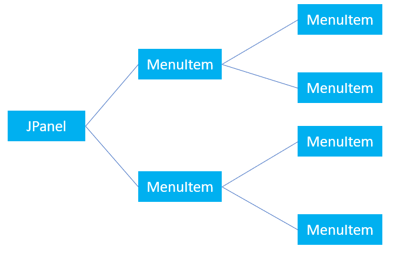
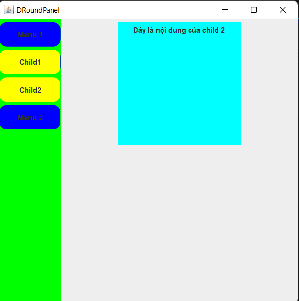

# MenuItem in Java class
Mô hình sử dụng của MenuItem

MenuItem có thể chứa các tập con MenuItem, hoạt động theo như một cây
Khi click vào một MenuItem, nếu MenuItem đó có các thành phần con thì nó sẽ hiện.

# Demo
